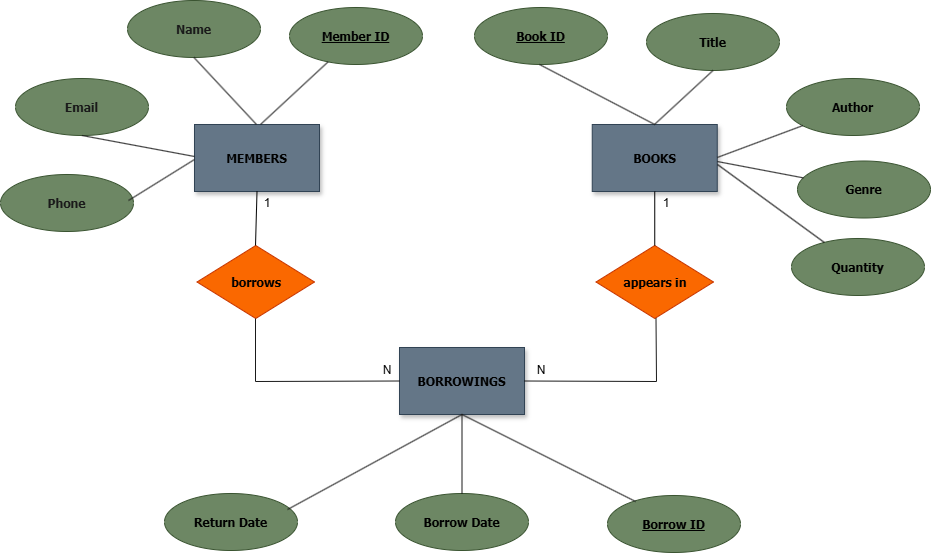
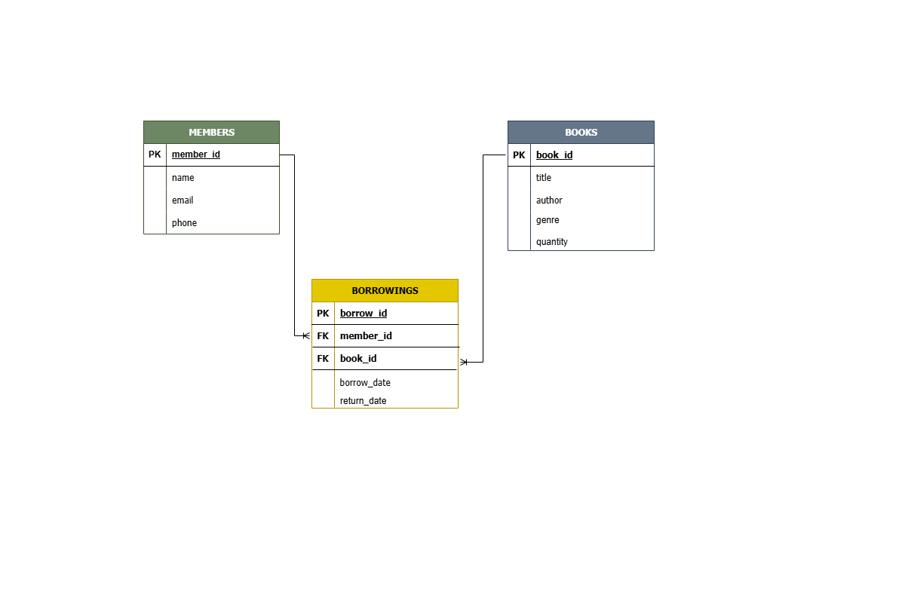

# Library Management System

**CCCS 105 - Information Management**  
*A Python-based database application for managing library operations*

---

## Table of Contents

1. [Introduction](#introduction)
2. [Project Objectives](#project-objectives)
3. [Business Rules](#business-rules)
4. [Database Models](#database-models)
5. [Project Overview](#project-overview)
6. [Setup Instructions](#setup-instructions)
7. [Team Members & Roles](#team-members--roles)
8. [Dependencies](#dependencies)
9. [Running Instructions](#running-instructions)

---

## Introduction

### Background

The Library Management System is a web-based application designed to streamline the operations of a library. Libraries today face challenges in managing their book inventory, member registrations, and borrowing transactions manually. This application provides an efficient, digital solution to automate these processes and improve accessibility for librarians.

The system addresses the need for a centralized platform where librarians can easily manage books, track member information, and monitor borrowing activities. By automating these tasks, the application reduces human error, saves time, and enhances the overall efficiency of library operations.

### Problem Statement

Libraries struggle with several key challenges:

* Manual book tracking — Difficult to maintain accurate inventory records
* Member management — Time-consuming to register and manage member information
* Borrowing records — Hard to track who borrowed which books and when
* Data accessibility — Information scattered across different systems
* Report generation — Difficult to generate borrowing statistics and overdue reports

## Scope

### What is Included

- Admin authentication and login system
- Complete CRUD operations for books, members, and borrowing records
- Search functionality to find books and members
- Real-time inventory tracking
- Borrowing transaction management
- Data validation and error handling

---

### What is NOT Included

- Email notifications for overdue books
- Mobile application
- Advanced analytics and reporting
- Payment processing for fines
- Book recommendation system

---

## Target Users

### Librarians / Staff
Use the system to:
- Manage book inventory
- Register members
- Process borrowing transactions

### Library Administrators
Use the system to:
- Monitor library operations
- Ensure system efficiency through the admin dashboard

---

## Project Objectives

### Primary Objective

Develop a functional web-based Library Management System that enables librarians to efficiently manage books, members, and borrowing transactions through a user-friendly interface connected to a MySQL database.

---

### Secondary Objectives

#### Database Connectivity
Establish reliable connection to a MySQL database for data persistence.

#### User Interface
Create an intuitive and responsive user interface that is easy for non-technical users.

#### Data Management
Implement complete CRUD (Create, Read, Update, Delete) operations for all core entities.

#### Search Functionality
Enable quick retrieval of books and member records.

#### Authentication & Security
Implement a login system to secure database access.

#### Data Validation
Ensure data integrity through comprehensive validation rules.

#### Error Handling
Provide meaningful error messages and graceful error recovery.

---

## Business Rules

### Detailed Business Logic

#### User Authentication
- Only authorized administrators/librarians can log in using valid credentials
- Default login credentials:
  - Username: `admin`
  - Password: `admin123`
- Session management ensures the admin remains logged in during the active session
- Unauthorized access is prevented through login validation

---

#### Database Connection Settings
- Database: `cccs105`
- Host: `localhost`
- Port: `3306`
- Username: `root`
- Password: `(empty/default XAMPP)`

---

#### CRUD Operation Constraints
- Book titles cannot be empty
- Member names must contain letters only (no numbers or symbols)
- Member email must follow valid email format
- Phone numbers must contain numeric values only
- Phone numbers must not exceed 12 digits
- Borrow date is mandatory for all borrowing records
- Quantity must be a positive integer

---

#### Data Validation Rules
- Email validation:
  - Must contain `@`
  - Must include a valid domain extension such as `.com`, `.net`, or `.org`
- Phone validation:
  - Numeric input only
  - Maximum of 12 digits
- Name validation:
  - Letters and spaces only
  - No special characters
- Title validation:
  - Cannot be empty
- Date validation:
  - Borrow date must be valid and not in the future

---

#### Access Control Levels
- Only authenticated admins can access the system
- Admin has full access to all features and CRUD operations
- Admin can manage:
  - Books
  - Members
  - Borrowing records
- No role-based restrictions or user hierarchy implemented

---

## Constraints

### Technical Constraints
- Requires:
  - XAMPP
  - Python 3.x
  - MySQL database

---

### Operational Constraints
- Single authenticated admin session at a time

---

### Data Constraints
- Phone numbers limited to 12 digits maximum

---

### Performance Constraints
- System optimized for small to medium-sized library operations

---

## Conditions

### Session Handling
- Sessions expire after browser closure

---

### Login Attempts
- No limit on login attempts
- Feature may be implemented in future versions

---

### Data Persistence
- All changes are immediately saved to the database

---

### Concurrent Access
- System designed primarily for single-user sessions

## Database Models

### Entity Relationship Diagram (ERD)



---

### Entity Descriptions

### BOOKS
Represents all books in the library inventory.

- Stores book title, author, genre, and available quantity
- Primary Key: `book_id`

---

### MEMBERS
Represents all registered library members.

- Stores member name, email, and phone number
- Primary Key: `member_id`

---

### BORROWINGS
Records the transactions between members and books.

- Links members to books through borrowing records
- Tracks borrow date and return date
- Primary Key: `borrow_id`
- Foreign Keys:
  - `book_id` references `BOOKS(book_id)`
  - `member_id` references `MEMBERS(member_id)`

---

## Relationships

- One member can have many borrowings `(1:N)`
- One book can appear in many borrowings `(1:N)`
- `BORROWINGS` acts as a junction table connecting `MEMBERS` and `BOOKS`

## Relational Model



---

### Table Specifications

| Table | Attributes | Data Types | Primary Key |
|-------|------------|------------|--------------|
| **BOOKS** | `book_id`, `title`, `author`, `genre`, `quantity` | `INT`, `VARCHAR(255)`, `VARCHAR(255)`, `VARCHAR(100)`, `INT` | `book_id` |
| **MEMBERS** | `member_id`, `name`, `email`, `phone` | `INT`, `VARCHAR(255)`, `VARCHAR(255)`, `VARCHAR(12)` | `member_id` |
| **BORROWINGS** | `borrow_id`, `book_id`, `member_id`, `borrow_date`, `return_date` | `INT`, `INT`, `INT`, `DATE`, `DATE` | `borrow_id` |

---

### Foreign Key Relationships

- `BORROWINGS.book_id` references `BOOKS(book_id)`
- `BORROWINGS.member_id` references `MEMBERS(member_id)`

---

### Relationship Summary

- One member can have many borrowings `(1:N)`
- One book can appear in many borrowings `(1:N)`
- `BORROWINGS` serves as the transaction table connecting `BOOKS` and `MEMBERS`

## Project Overview

### Architecture & Design Pattern

The application follows the **MVC (Model-View-Controller)** architectural pattern:

- **Model** — MySQL database and Python business logic handle data management
- **View** — HTML templates render the user interface
- **Controller** — Python Flask routes manage user requests and responses

### Technology Stack

- **Backend**: Python 3.x with Flask framework
- **Database**: MySQL (via XAMPP)
- **Frontend**: HTML5, CSS3, JavaScript
- **Server**: Flask development server (localhost:5000)

### Key Components

1. **Authentication Module** — Admin login system with session management
2. **Book Management** — CRUD operations for library books
3. **Member Management** — Register and manage library members
4. **Borrowing Module** — Track book borrowing and returns
5. **Search Engine** — Find books and members by various criteria
6. **Database Layer** — MySQL connectivity and data queries
7. **User Interface** — Responsive web pages for all operations

## Setup Instructions

### Prerequisites

* Python 3.8 or higher
* XAMPP (for MySQL and Apache)
* Git (for version control)
* Web browser (Chrome, Firefox, Edge, Safari)
* Text editor or IDE (VS Code recommended)

### Step-by-Step Installation

#### 1. Clone the Repository

```bash
git clone https://github.com/YOUR-USERNAME/library-system-cccs105.git
cd library-system-cccs105
```

#### 2. Set Up Virtual Environment

```bash
# Windows
python -m venv venv
venv\Scripts\activate

# Mac/Linux
python3 -m venv venv
source venv/bin/activate
```

#### 3. Install Dependencies

```bash
pip install -r requirements.txt
```

#### 4. Start XAMPP Services

1. Open XAMPP Control Panel
2. Start **Apache** (if needed for future features)
3. Start **MySQL**
4. Verify both are running (green indicators)

#### 5. Configure & Import Database

1. Open your browser and go to `http://localhost/phpmyadmin`
2. Click **"New"** on the left sidebar
3. Create new database: `cccs105`
4. Click on the new `cccs105` database
5. Click **"Import"** tab
6. Select `database/schema.sql` from your project folder
7. Click **"Go"** to create tables
8. (Optional) Import `database/initial_data.sql` for sample data

#### 6. Set Environment Variables

No additional environment variables needed for this project (all defaults are configured)

#### 7. Run the Application

```bash
python app.py
```

You should see: `* Running on http://127.0.0.1:5000`

#### 8. Access the Application

Open your web browser and go to: http://127.0.0.1:5000

## Team Members & Roles

| Member Name | Role | Responsibilities |
|-------------|------|------------------|
| Calvelo, Mark Paul B. | Developer | Coding, UI design, database design, ERD/RM diagrams, README documentation |
| Evangelista, Marc Ace T. | Developer | Coding, Feature testing, suggesting error handling implementations, code review |
| Lerio, Janline B. | UI/UX Designer | UI design, adding sample members and books data, frontend improvements |

## Dependencies

### Python Packages

* **Flask** 3.1.3 — Web framework
* **mysql-connector-python** 8.0.33 — MySQL database connectivity

### System Requirements

* **Operating System:** Windows 10/11, macOS 10.14+, or Linux (Ubuntu 18.04+)
* **Python Version:** 3.8 or higher
* **MySQL Version:** 5.7 or higher
* **Browser:** Chrome 90+, Firefox 88+, Safari 14+, Edge 90+
* **RAM:** Minimum 2GB
* **Disk Space:** Minimum 500MB

## Running Instructions

### Starting the Application

1. Start XAMPP (MySQL must be running)
2. Navigate to project directory in terminal
3. Run: `python app.py`
4. Open browser to: `http://127.0.0.1:5000`

### Stopping the Application

1. Press `Ctrl + C` in the terminal running Flask
2. Stop MySQL in XAMPP Control Panel

### Default Login Credentials

* Username: admin
* Password: admin123

### Navigation Guide

**Dashboard** — View system statistics:
* Total books in inventory
* Total registered members
* Books currently borrowed
* Overdue books

**Manage Books** — Complete book inventory management:
* View all books with search functionality
* Add new books to the library
* Edit book information
* Delete books from inventory

**Manage Members** — Handle member registrations:
* View all registered members with search
* Register new members (name, email, phone)
* Update member information
* Remove member records

**Borrowings** — Track borrowing transactions:
* View all borrowing records with status
* Create new borrowing records
* Update return dates
* Delete borrowing records

### Main Features

1. **Search** — Use search bars on each page to filter records
2. **Add Records** — Click "Add" buttons to create new entries
3. **Edit Records** — Click "Edit" to modify existing information
4. **Delete Records** — Click "Delete" with confirmation modal
5. **Logout** — Click logout button in sidebar to end session

## Additional Notes

* The application uses a warm brown and gold theme for a library aesthetic
* All dates should be in YYYY-MM-DD format
* Phone numbers are limited to 12 digits
* Emails must follow standard format (example@domain.com)
* Ensure MySQL is always running before accessing the application

